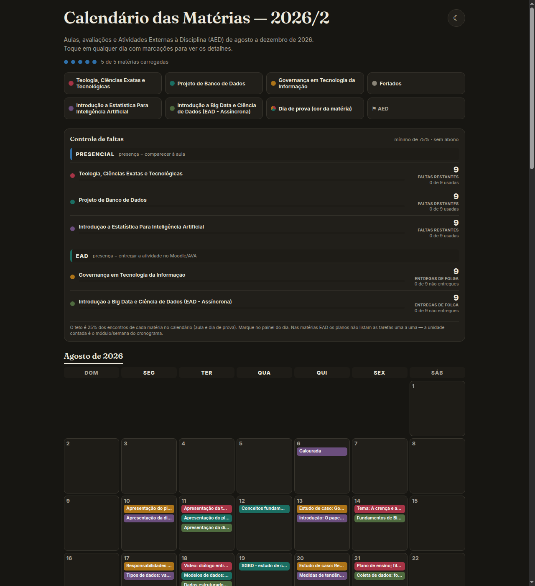

<div align="center">

# 📅 Calendário das Matérias

**Um semestre inteiro da faculdade em uma única página — aulas, provas, AEDs e controle de faltas.**

Sem build. Sem framework. Sem backend. Três arquivos estáticos e um duplo clique.


<br><br>



</div>

---

## Por que existe

Todo semestre a mesma cena: cinco planos de ensino em PDF, cada um com um cronograma
diferente, e a data da prova perdida na página 4. Este projeto lê esses PDFs e transforma
tudo em **um calendário só** — com as provas destacadas e um contador que avisa quantas
faltas ainda cabem antes de você rodar por frequência.

O site em si é **HTML, CSS e JavaScript puro**. Os dados moram dentro do próprio
`index.html`, em dois blocos JSON. Não há servidor, conta de usuário ou banco de dados:
o que você marca fica no `localStorage` do seu navegador.

## ✨ O que ele faz

- **Semestre inteiro em grade**, um mês embaixo do outro, com fins de semana e feriados
  destacados. Os meses saem dos próprios dados — o calendário cobre exatamente o período
  que você importar.
- **Detalhes por dia** — toque em qualquer dia marcado e abre um painel com os compromissos daquela data.
- **Filtro por disciplina** — a legenda funciona como interruptor: desligue uma matéria e ela some da grade.
- **Destaque de avaliações** — dia de prova ganha borda colorida; com mais de uma prova no
  mesmo dia, a borda mostra as cores de todas as disciplinas envolvidas.
- **Controle de faltas** — marque "Faltei" (presencial) ou "Não entreguei" (EAD) evento por
  evento. O painel mostra quantas faltas ainda restam por matéria, com teto de **25% dos
  encontros** (o mínimo de 75% de frequência).
- **Marcar dia como concluído** para acompanhar o avanço do semestre.
- **Tema claro e escuro** em um clique.
- **Memória local** — tema, dias concluídos e faltas ficam salvos no navegador.
- **Feito para celular primeiro**: 3 chips por dia cabem em qualquer tela a partir de 320px.

> **EAD ≠ AED.** *EAD* é a modalidade da matéria (presença = entregar a atividade no
> Moodle/AVA). *AED* é uma Atividade Externa à Disciplina — uma avaliação específica, que
> não conta como encontro para frequência.

## 🚀 Como rodar

```bash
git clone https://github.com/pexaan/Calendario.git
cd Calendario
xdg-open index.html      # Linux   (macOS: open index.html)
```

É isso — não tem `npm install`, não tem build, não precisa de servidor. O repositório vem
com um semestre de exemplo já carregado, só para você ver a cara da coisa funcionando.

## 🎓 Usando com o *seu* semestre

Este é o caminho principal do projeto: você roda tudo na sua máquina, com os planos de
ensino da sua faculdade. Nada é enviado para lugar nenhum.

```bash
make zerar            # 1. apaga o semestre de exemplo (pede confirmação)
cp ~/planos/*.pdf planos/   # 2. joga os seus PDFs na pasta planos/
make planos           # 3. mostra o que seria importado, sem escrever nada
make planos-aplicar   # 4. gosta do que viu? grava no index.html
```

Você não precisa digitar código, nome, cor ou ano de disciplina nenhuma: o importador lê
tudo do cabeçalho de cada PDF.

**Requisitos:** só para o importador — Node.js 18 ou mais novo. O site em si não precisa de
nada. `make` cuida do `npm install` na primeira execução.

> **Conte com uma revisada depois.** Plano de ensino é documento livre: cada professor
> formata do seu jeito, e sempre sobra uma linha que o parser lê torto. Rode `make planos`
> antes de aplicar, olhe as listas de **conflito** e **REVISAR MANUALMENTE**, e ajuste o que
> ficou estranho direto no JSON do `index.html` — são só objetos, dá para editar à mão.

```bash
make ajuda            # lista todos os comandos
make servir           # abre em http://localhost:8000
make testes           # roda as checagens no Chrome headless
```

## 🗂️ Estrutura

```
.
├── index.html   # marcação + os dois blocos de dados JSON
├── style.css    # temas claro/escuro via variáveis CSS
├── script.js    # toda a lógica (calendário, faltas, frequência)
├── Makefile     # atalhos locais (make ajuda lista tudo)
├── planos/      # seus PDFs entram aqui (ficam fora do git)
├── docs/        # ARQUITETURA.md — por que o código é assim
└── tools/       # manutenção local — o navegador nunca carrega isto
    ├── import-plano/         # CLI Node: PDF do plano → eventos no index.html
    ├── rodar-testes.sh
    ├── test-frequencia.html  # 19 checagens
    └── test-faltas.html      # 13 checagens
```

> A raiz **não tem `package.json`** de propósito: é o que faz a Vercel tratar o repositório
> como site estático em vez de projeto Node. O importador tem o `package.json` dele, isolado
> em `tools/import-plano/`.

## 🧩 Os dados

Tudo que aparece na tela vem de dois blocos dentro do `index.html`:

```html
<script type="application/json" id="events-data"> [ ... ] </script>
<script type="application/json" id="disc-meta">   { ... } </script>
```

Adicionar um compromisso é adicionar um objeto no array:

```json
{
  "date": "2026-08-11",
  "disc": "FIT1620",
  "title": "Apresentação da turma",
  "type": "aula"
}
```

| Campo | Descrição |
| --- | --- |
| `date` | Data em `AAAA-MM-DD` |
| `disc` | Código da disciplina — precisa existir em `#disc-meta` |
| `title` | Texto exibido no chip do dia e no painel de detalhes |
| `type` | `aula`, `avaliacao`, `aed` ou `feriado` |
| `desc` | *(opcional)* observação extra, aparece só no painel |

E cada disciplina é registrada assim:

```json
"CMP2303": { "name": "Projeto de Banco de Dados", "color": "#1B6E62", "modalidade": "presencial" }
```

`modalidade` (`presencial` ou `ead`) é o que decide se o botão do evento diz "Faltei" ou
"Não entreguei".

## 🤖 Importador de planos de ensino

Digitar 200 eventos na mão não é plano. `tools/import-plano` lê os PDFs dos planos de
ensino, reconstrói o cronograma e escreve os eventos direto no `index.html`.

```bash
make planos           # lê todos os PDFs de planos/ e mostra o que entraria (não escreve)
make planos-aplicar   # grava os eventos novos no index.html
```

Não é preciso informar nada: o código da disciplina, o nome, a modalidade e o ano saem do
cabeçalho de cada PDF. O que o importador **não** faz sozinho, de propósito:

- **Nunca sobrescreve** um evento existente — datas em conflito vão para uma lista à parte,
  para você decidir.
- Linhas ambíguas ("Devolutiva da Avaliação P1" é aula ou prova?) caem em **REVISAR
  MANUALMENTE** e não entram automaticamente.
- Sem `--apply`, o padrão é preview: ele mostra o que faria e não toca em nada.

Para um PDF só, informando os dados na mão:

```bash
node tools/import-plano/import-plano.js --pdf planos/arquivo.pdf \
  --disc CMP1234 --name "Nome da Matéria" --color "#2E5C8A" --modalidade presencial
```

<details>
<summary>Como ele lê o PDF</summary>

A extração é **posicional**: o `pdfjs-dist` devolve cada fragmento de texto com as
coordenadas x/y, e as linhas são remontadas agrupando fragmentos pela mesma altura. Isso é
obrigatório — bibliotecas que achatam o texto perdem a separação entre as colunas da tabela
do cronograma.

Mesmo assim, PDFs reais colam várias linhas do cronograma numa linha só de texto extraído.
Por isso o parser procura **todas** as datas de cada linha e fatia o conteúdo entre elas,
reconhecendo formatos como `10/ago`, `dd/mm/aaaa`, `11 de agosto de 2026` e intervalos
tipo `26 a 29/10`.

</details>

## 🧪 Testes

Sem framework e sem dependência: as páginas de teste carregam o `index.html` **real** dentro
de um `<iframe>` e conferem os números na saída.

```bash
make testes
```

```
✓ test-frequencia — 19 PASS
✓ test-faltas — 13 PASS
```

Precisa de Chrome ou Chromium instalado. Cada checagem escreve uma linha `PASS` ou `FALHOU`
no elemento `#result` da página — dá para abrir `tools/test-frequencia.html` no navegador e
ler o resultado direto, se preferir.

## 🤝 Contribuindo

Ideias, correções e PRs são bem-vindos — principalmente relatos de **planos de ensino que o
importador leu errado**, que é a parte mais frágil do projeto. Se puder, descreva o formato
da linha que quebrou (sem anexar o PDF, que costuma ser material da sua instituição).

Três coisas que ajudam:

1. **Não crie um `package.json` na raiz** — quebra o deploy estático.
2. **Comentários e mensagens de commit em português**, seguindo o resto do código.
3. Rode `make testes` antes de abrir o PR.

O [`docs/ARQUITETURA.md`](docs/ARQUITETURA.md) explica as decisões do código que não são
óbvias — vale a leitura antes de mexer no CSS dos chips ou na contagem de frequência.

## 🗺️ Próximos passos

- [ ] Exportar as datas para `.ics` (Google Calendar / Outlook)
- [ ] Contagem regressiva para a próxima avaliação
- [ ] Regra de frequência por carga horária, para as matérias EAD que contam horas em vez de encontros

## 📄 Licença e créditos

[MIT](LICENSE) — use, altere e publique à vontade.

O ícone do calendário (`favicon.svg`) vem do [SVG Repo](https://www.svgrepo.com/).
As fontes são [Fraunces](https://fonts.google.com/specimen/Fraunces) e
[Inter](https://fonts.google.com/specimen/Inter), via Google Fonts.

---

<div align="center">
Feito por <a href="https://github.com/pexaan"><b>Pedro Terra</b></a> para não perder mais nenhuma prova.
</div>
